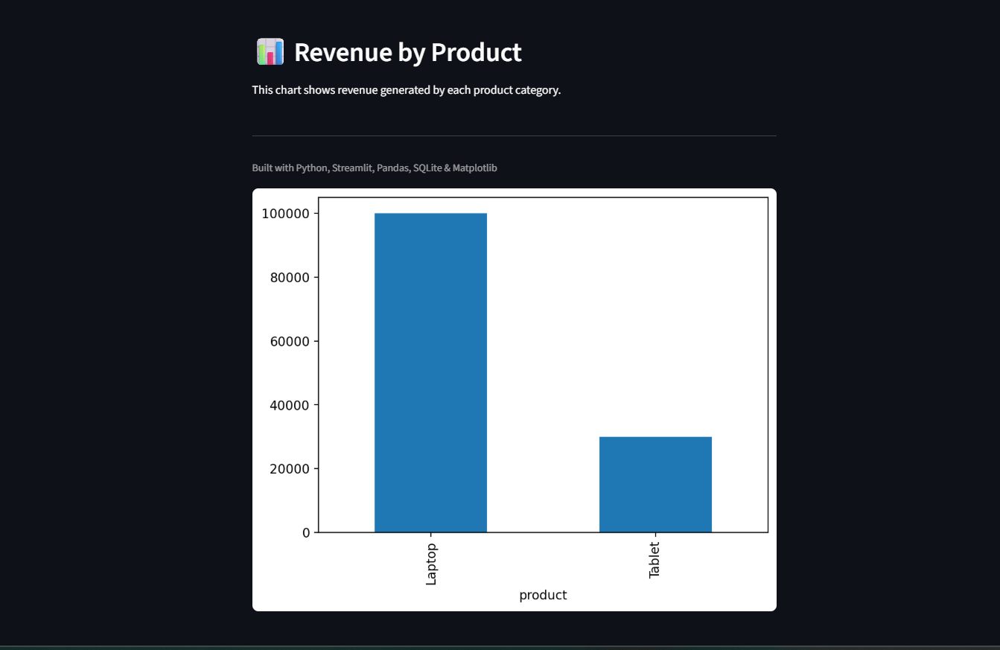
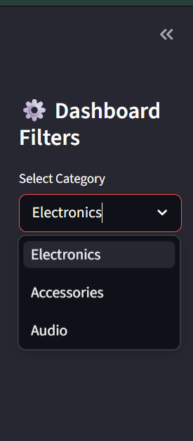

# 📊 Sales Analytics Pipeline

An end-to-end Python-based sales analytics platform that automates data cleaning, SQL analytics, business reporting, visualization, and interactive dashboard generation using Streamlit.

This project demonstrates real-world data engineering and analytics workflow concepts including ETL pipelines, SQLite integration, advanced SQL queries, visualization systems, logging, configuration management, and interactive business dashboards.

---

## Live Dashboard

[Live Demo](https://sales-analytics-pipeline-0526.streamlit.app/)

---

## Features

- Automated sales data cleaning
- Missing value and duplicate handling
- SQLite database integration
- Advanced SQL analytics queries
- Revenue and business KPI generation
- Interactive Streamlit dashboard
- Dynamic category filtering
- Data visualization using Matplotlib
- JSON and text report generation
- Config-driven architecture
- Logging and error handling system
- Modular project structure

---

## Tech Stack

- Python
- Pandas
- SQLite
- SQL
- Matplotlib
- Streamlit
- JSON
- Python Logging Module
- Git & GitHub

---

## Project Architecture

```text
Raw CSV Data
      ↓
Data Cleaning Pipeline
      ↓
SQLite Database Storage
      ↓
Advanced SQL Analytics
      ↓
Data Visualization
      ↓
Interactive Dashboard
      ↓
Report Generation
      ↓
Logging & Configuration Management
```

---

## Project Structure

```text
sales-analytics-pipeline/
│
├── data/
│   └── sales.csv
│
├── output/
│   ├── cleaned_sales.csv
│   ├── report.json
│   ├── report.txt
│   ├── revenue_chart.png
│   ├── category_revenue_chart.png
│   └── category_pie_chart.png
│
├── screenshots/
│   ├── dashboard_main.png
│   ├── revenue_chart.png
│   └── sidebar_filter.png
│
├── logs/
│   └── .gitkeep
│
├── src/
│   ├── main.py
│   ├── cleaner.py
│   ├── analyzer.py
│   ├── reporter.py
│   ├── visualizer.py
│   ├── database.py
│   ├── dashboard.py
│   └── utils.py
│
|         
│   
│
├── sales.db
├── config.json
├── requirements.txt
├── .gitignore
└── README.md
```

---

## Business Metrics Generated

The pipeline automatically calculates:

- Total Revenue
- Average Revenue per Order
- Top Selling Product
- Revenue by Product
- Revenue by Category
- Category-wise Product Count
- SQL-based Revenue Analytics

---

## Data Cleaning Operations

The cleaning system performs:

- Duplicate removal
- Missing value handling
- Invalid datatype correction
- Negative value filtering
- Numeric conversion for analysis

---

## Database Operations

SQLite integration supports:

- Database creation
- Table creation
- Data insertion
- SQL analytics queries
- Persistent structured storage

---

## Advanced SQL Analytics

The project performs advanced SQL operations using:

- GROUP BY
- ORDER BY
- SUM()
- COUNT()

---

## Example SQL Queries

### Revenue by Category

```sql
SELECT category,
SUM(quantity * price) AS revenue
FROM sales
GROUP BY category;
```

### Top Selling Products

```sql
SELECT product,
SUM(quantity) AS total_quantity
FROM sales
GROUP BY product
ORDER BY total_quantity DESC;
```

### Product Count by Category

```sql
SELECT category,
COUNT(*) AS total_products
FROM sales
GROUP BY category;
```

---

## Dashboard Features

The Streamlit dashboard includes:

- Interactive KPI cards
- Sidebar category filters
- Revenue visualizations
- Interactive data tables
- Real-time filtered analytics
- Business insights dashboard UI

---

## Data Visualizations

Automatically generated charts include:

- Revenue by Product Bar Chart
- Revenue by Category Bar Chart
- Revenue Distribution Pie Chart

All generated visual outputs are stored inside:

```text
output/
```

---

## Generated Output Files

| File | Description |
|---|---|
| cleaned_sales.csv | Cleaned dataset |
| report.json | Structured business report |
| report.txt | Human-readable report |
| revenue_chart.png | Revenue by product visualization |
| category_revenue_chart.png | Revenue by category visualization |
| category_pie_chart.png | Revenue distribution pie chart |
| sales.db | SQLite database |
| app.log | Pipeline execution logs |

---

## How to Run

### Clone Repository

```bash
git clone <repository-url>
```

### Navigate to Project Directory

```bash
cd sales-analytics-pipeline
```

### Install Dependencies

```bash
pip install -r requirements.txt
```

### Run Analytics Pipeline

```bash
python src/main.py
```

### Run Streamlit Dashboard

```bash
python -m streamlit run src/dashboard.py
```

---

## Engineering Concepts Demonstrated

- ETL Pipeline Design
- Modular Programming
- SQLite Integration
- Advanced SQL Analytics
- Interactive Dashboard Development
- Data Visualization
- Logging Systems
- Configuration Management
- Error Handling
- File-Based Data Processing
- Business KPI Generation

---

## Dashboard Screenshots

### Main Dashboard


---

### Revenue Analytics



---

### Interactive Filters



---

## Future Improvements

- Cloud deployment
- Multi-page dashboards
- API-based data ingestion
- Real-time analytics
- Automated scheduling
- Authentication system
- Docker containerization
- Advanced business forecasting

---

## Author

**Nistha Bhattacharjee**


